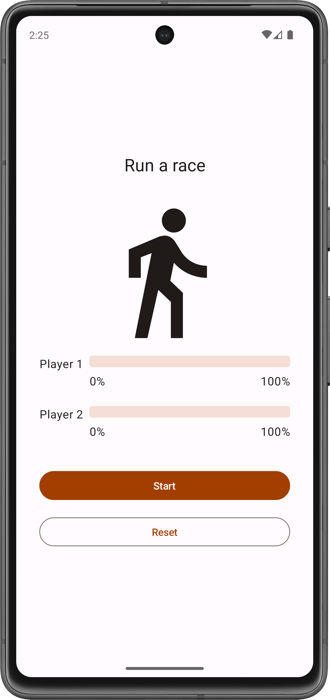
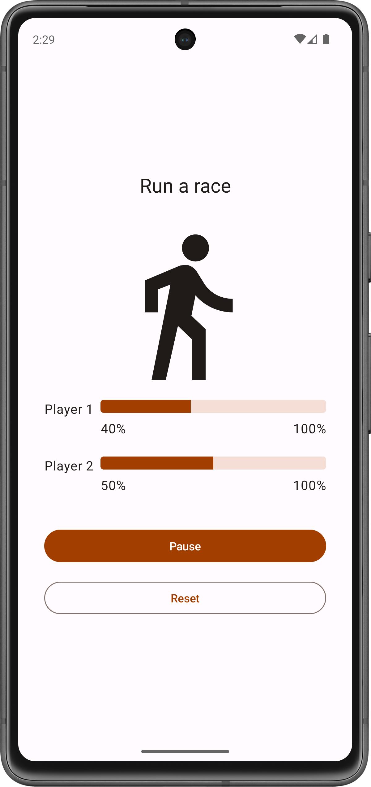

Race tracker app
=================================

<table>
    <td>
        
    </td>
    <td>
        
    </td>
</table>

The Race tracker app simulates the progress of two players in a race. The idea is to demonstrate
basic concepts of Kotlin coroutines. A user can start, pause, or reset the race with buttons in the
UI.

Pre-requisites
--------------

* Experience with building apps using Jetpack Compose.
* How to create and run a project in Android Studio.
* Familiar with Kotlin coroutines

Getting Started
---------------

1. Install Android Studio, if you don't already have it.
2. Download the sample.
3. Import the sample into Android Studio.
4. Build and run the sample.
